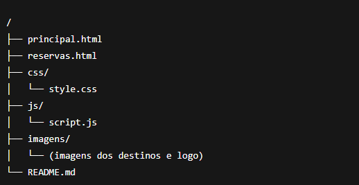

# Top Turismo - Sistema de Reservas de Viagens ✈️
TopTurismo é um site de reservas de viagens criado com HTML, CSS, JavaScript e Bootstrap, oferecendo uma interface
moderna para navegar por destinos turísticos, visualizar imagens e calcular reservas. A página principal exibe
um carrossel com destinos populares, cards informativos e acesso rápido ao formulário de reserva. Já a
página de reservas permite inserir nome, escolher destino, selecionar quantidade de passageiros e tipo de
assento, exibindo um resumo da viagem ao final. O projeto também conta com suporte a tema claro/escuro,
responsividade e ícones para um toque mais profissional.

# Funcionalidades 🚀 
## Página Principal (principal.html) 
 • Carrosel com imagens de destinos Brasileiros.   
 • Botão "fazer reserva" em cada slide.   
 • Cards com distâncias entre Brasília e os destinos.   
 • Sessão de destaque convidando o usuário a reservar   
 • Tema claro e escuro com seleção via DropDown  

## Página de Reservas (reservas.html) 
• Formulário intuitivo para:   
ㅤ •  Nome do passageiro  
ㅤ •  Destino   
ㅤ •  Quantidade de passageiros   
ㅤ •  Tipo de assento   
• Exibição de resumo da reserva após confirmação.  
• Botão para reiniciar o processo.   
• Layout centralizado e totalmente responsivo.

# Tecnologias Utilizadas 🖥️

 

 
 
 
 
 

# Modo Claro/Escuro 🌗
O site inclui um seletor de tema que permite alternar entre Light Mode e Dark Mode, garantindo uma experiência confortável em qualquer ambiente.

# Estrutura do Projeto 📁

 

# Demonstração Visual 📸

